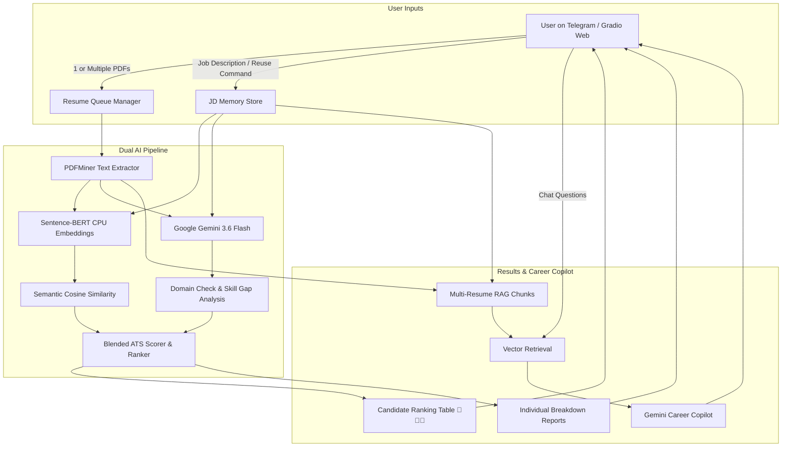

# ATS Score — AI-Powered Resume Analyzer & Telegram Career Copilot

[](https://t.me/MyResumeIQBot)
[](https://huggingface.co/spaces/Sivaram221/ATS_score_bot)
[](https://www.python.org/)
[](https://deepmind.google/technologies/gemini/)
[](https://www.sbert.net/)

> **Try the Bot on Telegram:** [@MyResumeIQBot](https://t.me/MyResumeIQBot)  
> **Or use the Gradio Web App:** [Hugging Face Space](https://huggingface.co/spaces/Sivaram221/ATS_score_bot)

**ATS Score** is a 24/7 AI-powered recruitment intelligence tool and Telegram Chatbot that evaluates candidate resumes against any Job Description (JD) using **Sentence-BERT semantic similarity on CPU**, **Google Gemini AI deep audit**, and an interactive **Retrieval-Augmented Generation (RAG) Career Copilot**.

Upload **one or multiple PDF resumes**, paste a job description, and get honest, skill-grounded ATS scores, comparative candidate rankings, skill gap audits, and interactive coaching.

---

## 🚀 Key Highlights & New Capabilities

- 📄 **Multi-Resume Batch Evaluation & Ranking**: Upload 1 or multiple candidate resumes at a time. The bot queues them, analyzes all candidates against the target JD, and generates a **Comparative Ranking Leaderboard** (🥇, 🥈, 🥉) alongside full individual breakdowns.
- 🎯 **Accurate, Skill-Grounded Scoring**: Eliminates inflated/generic ATS scores. Scoring strictly penalizes mismatched domains or missing mandatory tech stacks (evaluating an unrelated resume against a mismatched JD scores <20%, reflecting real recruiter filtering).
- 💬 **Conversational Context Reuse**:
  - Reply **`use previous JD`** or **`same JD`** to analyze new resumes against your last job posting.
  - Reply **`use previous resume`** to evaluate your already-uploaded candidate(s) against a brand-new role.
- 🤖 **Interactive AI Career Copilot**: Ask follow-up questions grounded directly in the candidate profiles and JD requirements (e.g., *"Why is Docker missing?"*, *"Who is the strongest candidate for senior backend?"*, *"How can I improve my score?"*).
- ☁️ **24/7 Cloud Ready**: Runs continuously on Hugging Face Spaces (via Gradio dual-runner) or via Docker container on any cloud host.

---

## 🤖 Telegram Bot Workflow

```
You (Telegram @MyResumeIQBot)
  │
  ├── 📎 Send 1 or More Resume PDFs
  │       └── Bot extracts text and queues candidates
  │       └── Prompts: "Send or paste the Target Job Description"
  │
  ├── 📝 Paste Target Job Description (or reply "use previous JD")
  │       └── Bot runs Gemini + CPU Sentence-BERT:
  │           ├── Multi-Candidate Comparative Leaderboard (🥇, 🥈, 🥉)
  │           ├── Honest ATS Match Score (%) & Visual Gauge
  │           ├── Recruiter Verdict & Role Alignment Category
  │           ├── Verified Matched Skills Checklist
  │           ├── Missing Skills / Keywords Gap Audit
  │           └── Actionable Step-by-Step Improvement Plan
  │
  ├── 💬 Ask follow-up questions
  │       └── RAG Career Copilot (answers grounded in all resumes + JD)
  │
  └── 📄 /export → Download complete .txt audit report
```

---

## 📋 Bot Commands & Shortcuts

| Command / Trigger | Description |
| :--- | :--- |
| `/start` | Welcome message, workflow guide, and quick actions |
| `/help` | Detailed instructions on multi-resume upload and reuse shortcuts |
| `/sample` | Instant benchmark demonstration using a Senior Python Engineer profile |
| `/report` | Re-display the latest analysis report or ranking table |
| `/export` | Download a clean, formatted `.txt` audit report |
| `/reset` | Clear active memory session and start fresh |
| `use previous JD` | Evaluates pending resumes against the last job description |
| `use previous resume` | Re-loads previous candidate resumes to test with a new job description |

---

## 🏗️ System Architecture



---

## 🛠️ Technology Stack

| Component | Technology |
| :--- | :--- |
| **Telegram Bot Engine** | `python-telegram-bot` v22.8 |
| **Web Interface** | Gradio 5.15.0 |
| **Language** | Python 3.10+ |
| **Large Language Model** | Google Gemini (`gemini-3.6-flash`) |
| **Semantic Embedding** | Sentence-BERT (`all-MiniLM-L6-v2` enforced CPU execution) |
| **Vector Retrieval** | Scikit-learn Cosine Similarity / Custom TF-IDF |
| **PDF Extraction** | PDFMiner (`pdfminer.six`) |
| **Deployment** | Hugging Face Spaces / Docker / Docker Compose |

---

## 📂 Project Structure

```
ResumeIQ/
├── app.py                  # Gradio Web UI + 24/7 Telegram Bot Thread Runner
├── bot.py                  # Telegram Bot Interface & Event Handlers
├── config.py               # Environment Configuration & Validation
├── requirements.txt        # Python dependencies
├── Dockerfile              # Container definition for cloud deployment
├── docker-compose.yml      # Local / VM container orchestration
├── .env.example            # Environment variable template
├── .gitignore              # Protects secrets, cache, and virtualenvs
│
└── services/
    ├── __init__.py
    ├── case_store.py       # Multi-resume queue, session state & chat memory
    ├── gemini_service.py   # Gemini prompt engineering, domain check & scoring
    ├── pdf_service.py      # PDF text extraction via pdfminer
    ├── rag_service.py      # Multi-candidate document chunking & RAG retrieval
    └── similarity_service.py  # CPU Sentence-BERT embeddings & cosine similarity
```

---

## ⚙️ Setup & Installation

### 1. Clone the Repository

```bash
git clone https://github.com/Sivaram1024/ATS_score.git
cd ATS_score
```

### 2. Create Virtual Environment

```bash
python -m venv .venv

# Windows
.venv\Scriptsctivate

# Linux / macOS
source .venv/bin/activate
```

### 3. Install Dependencies

```bash
pip install -r requirements.txt
```

### 4. Configure Environment Variables

Create your `.env` file from the provided template:

```bash
# Windows
copy .env.example .env

# Linux / macOS
cp .env.example .env
```

Edit `.env` with your API keys:

```env
GEMINI_API_KEY=your_google_gemini_api_key
TELEGRAM_BOT_TOKEN=your_telegram_bot_token
PORT=8080
```

> **Need keys?**  
> - Get a Google Gemini API Key at [Google AI Studio](https://aistudio.google.com/).  
> - Create a Telegram Bot and get a Bot Token via [@BotFather](https://t.me/BotFather).

---

## 🚀 Running Locally

### Option A: Telegram Bot Only

```bash
python bot.py
```

### Option B: Full Web UI + Telegram Bot (Gradio)

```bash
python app.py
```
This launches the Gradio Web UI at `http://localhost:7860` and starts the Telegram Bot polling worker concurrently.

### Option C: Docker (Production)

```bash
docker compose up -d --build
```
Or with standard Docker CLI:
```bash
docker build -t ats-bot .
docker run -d --name ats-bot --env-file .env --restart unless-stopped ats-bot
```

---

## ☁️ 24/7 Cloud Deployment Options

### 1. Hugging Face Spaces (100% Free)
1. Create a new Space on [Hugging Face Spaces](https://huggingface.co/spaces) with SDK set to **Gradio**.
2. Push this repository to the Space.
3. In your Space **Settings > Variables and secrets**, add:
   - `GEMINI_API_KEY`
   - `TELEGRAM_BOT_TOKEN`
4. The Space will build and keep your Gradio app and Telegram bot active 24/7!

### 2. Render / Railway / Koyeb
1. Connect your GitHub repository to [Render](https://render.com/) or [Railway](https://railway.app/).
2. Select **Docker** or **Python** environment.
3. Set environment variables `GEMINI_API_KEY` and `TELEGRAM_BOT_TOKEN`.
4. Deploy — the built-in HTTP health check server on port 8080 ensures high availability and uptime monitoring.

---

## 📄 License

This project is open source and available under the [MIT License](LICENSE).
