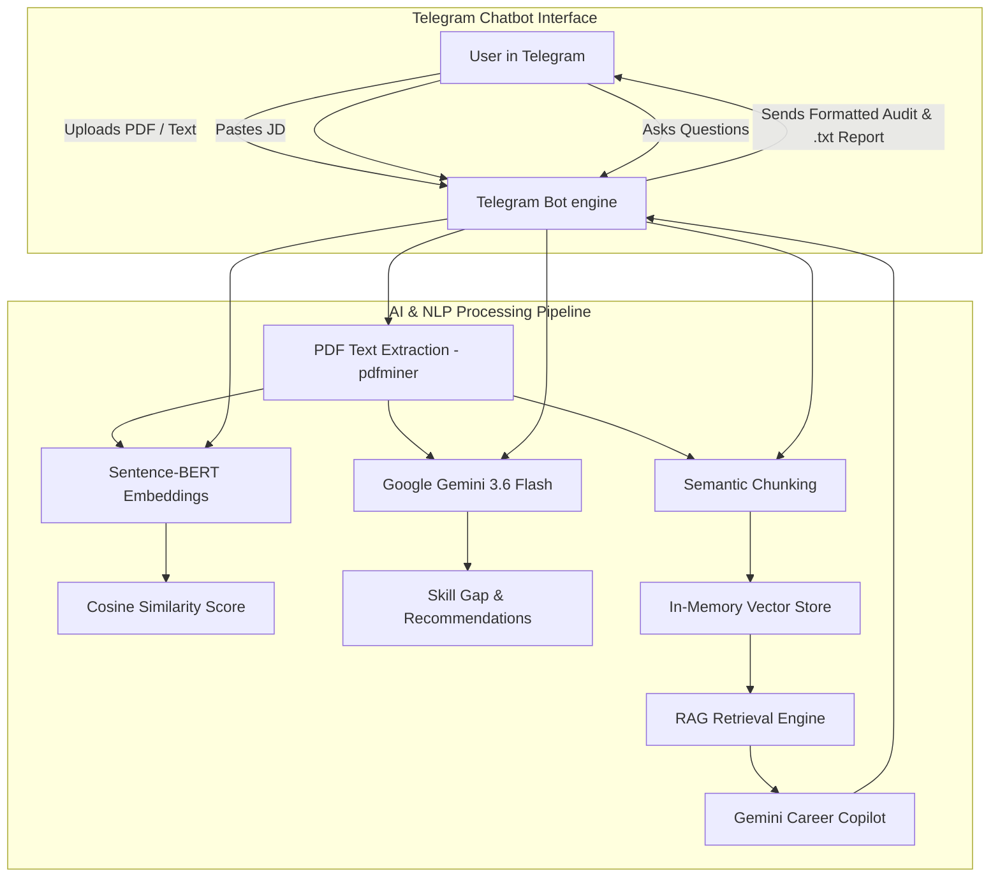

# ATS Score — AI-Powered Resume Analyzer & Telegram Career Copilot

[](https://telegram.org/)
[](https://sivaram1024.github.io/ATS_score/)
[](https://github.com/Sivaram1024/ATS_score)
[](https://www.python.org/)
[](https://deepmind.google/technologies/gemini/)
[](https://www.sbert.net/)

> **Live Interactive Demo:** [https://sivaram1024.github.io/ATS_score/](https://sivaram1024.github.io/ATS_score/)

Crafting a strong resume isn't just about matching keywords—it's about demonstrating the right skills and experiences in a way that aligns with the target role. Traditional ATS systems often rely heavily on keyword matching, making it difficult for applicants to understand why their resumes succeed or fail.

**ATS Score (ResumeIQ)** is an AI-powered resume analysis platform and **Telegram Chatbot** that combines **Sentence-BERT semantic similarity**, **Retrieval-Augmented Generation (RAG)**, and **Google's Gemini models (`gemini-3.6-flash`)** to evaluate how well a resume aligns with a job description.

Instead of a complex web-only portal, users can interact with the system entirely through a **Telegram Chatbot interface**: upload resume PDFs directly into chat, paste job descriptions, receive instant ATS score audits, and converse with an AI Career Copilot grounded in their resume.

---

# 🤖 Telegram Chatbot Interface

The primary user interface is an intelligent, conversational **Telegram Bot** powered by `python-telegram-bot` (v22+):

- 📎 **Direct PDF Resume Upload:** Send or forward any `.pdf` resume file directly into the chat; the bot extracts text and prepares it in-memory.
- 🎯 **Job Description Processing:** Paste target job descriptions directly as chat messages to trigger instantaneous AI analysis.
- 📊 **Hybrid ATS Scoring:** Combines dense Sentence-BERT cosine semantic similarity with Google Gemini structured skill verification.
- 🧠 **Interactive RAG Career Copilot:** Ask questions about your score, request bullet point rewrites, or practice interview questions directly in Telegram chat.
- 📄 **Exportable Audit Report:** Run `/export` at any time to receive a formatted `.txt` report file delivered directly to your Telegram chat.
- 🔄 **Session Management:** Isolate each user's state automatically with `/reset`, test instantly with `/sample`, and view help with `/help`.

### Telegram Bot Commands

| Command | Action |
| :--- | :--- |
| `/start` | Welcome message, workflow overview, and initial setup instructions |
| `/help` | Detailed guide on sending resumes, pasting job descriptions, and chatting |
| `/sample` | Loads pre-configured sample resume & job description for instant testing |
| `/report` | Re-displays the formatted ATS score, matched competencies, and suggestions |
| `/export` | Generates and sends a downloadable `.txt` ATS audit report file in chat |
| `/reset` | Clears current session, documents, and chat history for a fresh evaluation |

---

# 🌐 Live Web Showcase

For users who want an instant zero-install preview in their browser, the repository also hosts an interactive showcase:

👉 **[https://sivaram1024.github.io/ATS_score/](https://sivaram1024.github.io/ATS_score/)**

---

# Why ATS Score?

Most resume analyzers provide only a similarity score or generic AI suggestions. ATS Score combines semantic understanding with Retrieval-Augmented Generation (RAG) to deliver personalized, context-aware career guidance.

### Traditional Resume Checkers
- Keyword matching only
- Generic suggestions
- No contextual understanding
- Limited interaction after analysis
- Black-box feedback

### ATS Score (ResumeIQ)
- **Semantic Similarity** using Sentence-BERT (`sentence-transformers/all-MiniLM-L6-v2`)
- **ATS Compatibility Scoring** with cosine vector similarity
- **Skill Gap Analysis** powered by Google Gemini (`gemini-3.6-flash`)
- **Context-Aware RAG Copilot** grounded in document chunks
- **Conversational Telegram Experience** — no clunky forms, just natural chat
- **Downloadable Reports** sent right to your device

---

# 🏗️ System Architecture



---

# 🛠️ Technology Stack

| Category | Technology |
| :--- | :--- |
| **Bot Interface** | `python-telegram-bot` (v22.8) |
| **Programming Language** | Python 3.10+ |
| **AI Model** | Google Gemini (`gemini-3.6-flash`) |
| **Semantic Similarity** | Sentence-BERT (`sentence-transformers/all-MiniLM-L6-v2`) |
| **Vector Retrieval** | Scikit-learn Cosine Similarity & Dense Embeddings |
| **PDF Extraction** | PDFMiner (`pdfminer.six`) |
| **Environment Config** | python-dotenv |
| **Alternative Web UI** | Flask 3.0+ & Vanilla JavaScript |
| **CI/CD & Showcase** | GitHub Actions & GitHub Pages |

---

# 📂 Folder Structure

```text
ATS_score/
│
├── bot.py                      # Telegram Chatbot application (Primary Interface)
├── app.py                      # Flask web application (Alternative Interface)
├── config.py                   # Centralized configuration & environment validation
├── requirements.txt            # Python dependencies
├── README.md                   # Project documentation & guides
├── .gitignore                  # Git ignore rules (protects .env and caches)
├── .env.example                # Template for environment variables
├── LICENSE                     # Open source license
│
├── .github/
│   └── workflows/
│       └── deploy-pages.yml    # Automated GitHub Pages CI/CD workflow
│
├── docs/                       # Live GitHub Pages interactive deployment
│   ├── index.html              # Standalone interactive showcase web app
│   ├── style.css               # Styling and layout
│   ├── demo.js                 # Interactive client demo engine
│   └── screenshots/            # UI screenshots
│
├── routes/
│   └── main_routes.py          # Flask routes (/analyze, /results, /chat, /export)
│
├── services/
│   ├── case_store.py           # In-memory session storage and chat history
│   ├── gemini_service.py       # Gemini API integration & prompt schemas
│   ├── pdf_service.py          # PDF text extraction & validation
│   ├── rag_service.py          # Document chunking, vector indexing & retrieval
│   └── similarity_service.py   # Sentence-BERT embeddings & cosine similarity
│
├── static/
│   ├── css/
│   │   └── style.css           # Modern design system styles
│   └── js/
│       └── chat.js             # Async chat interactions
│
└── templates/
    ├── base.html               # Base layout with navbar
    ├── index.html              # Upload page
    └── results.html            # Results dashboard with scores & Copilot chat
```

---

# ⚙️ Quickstart & Setup

### 1. Clone the Repository

```bash
git clone https://github.com/Sivaram1024/ATS_score.git
cd ATS_score
```

### 2. Create and Activate Virtual Environment

**Windows:**
```bash
python -m venv .venv
.venv\Scripts\activate
```

**Linux / macOS:**
```bash
python3 -m venv .venv
source .venv/bin/activate
```

### 3. Install Dependencies

```bash
pip install -r requirements.txt
```

### 4. Configure Environment Variables

Create a `.env` file from the provided example:

```bash
cp .env.example .env   # Linux/Mac
copy .env.example .env # Windows
```

Edit `.env` and fill in your keys:

```env
# Google Gemini API Key (Required for AI Audit & RAG Chat)
# Get a free key at: https://aistudio.google.com/app/apikey
GEMINI_API_KEY=your_actual_gemini_api_key_here

# Telegram Bot Token (Required for Telegram Chatbot)
# Create a bot via @BotFather in Telegram: https://t.me/BotFather
TELEGRAM_BOT_TOKEN=your_telegram_bot_token_here

# Optional model configuration
GEMINI_MODEL=gemini-3.6-flash
BERT_MODEL_NAME=sentence-transformers/all-MiniLM-L6-v2
```

---

# 🚀 Running the Telegram Bot

### How to obtain your Telegram Bot Token:
1. Open Telegram and search for [@BotFather](https://t.me/BotFather).
2. Send the command `/newbot`.
3. Choose a name and a username for your bot (e.g. `MyResumeIQBot`).
4. Copy the HTTP API token provided by BotFather.
5. Paste it into your `.env` file:
   ```env
   TELEGRAM_BOT_TOKEN=123456789:ABCdefGhIJKlmNoPQRstuVWXyz
   ```

### Start the Bot:
```bash
python bot.py
```

Once started, open Telegram, search for your bot username, and send `/start`!

### Interacting with the Bot:
1. **Send your resume:** Send a PDF document file or paste your resume text.
2. **Send job description:** Paste the target job description text.
3. **Get analysis:** The bot will immediately run Sentence-BERT semantic similarity and Gemini evaluation, returning:
   - Overall ATS Match Score (%)
   - Skills Coverage (%)
   - Matched Skills list
   - Missing / Critical Skills list
   - Actionable recommendations
4. **Chat with AI Career Copilot:** Ask questions like:
   - *"How can I improve my score for this role?"*
   - *"Rewrite my first work experience bullet to match the job requirements."*
   - *"What interview questions might they ask me based on my missing skills?"*
5. **Export report:** Send `/export` to download a `.txt` analysis file.

---

# 🌐 Alternative: Running the Local Web App

If you also wish to run the local Flask web portal:

```bash
python app.py
```

Then visit [http://localhost:5000](http://localhost:5000) in your web browser.

---

# 📄 License

This project is licensed under the MIT License.
