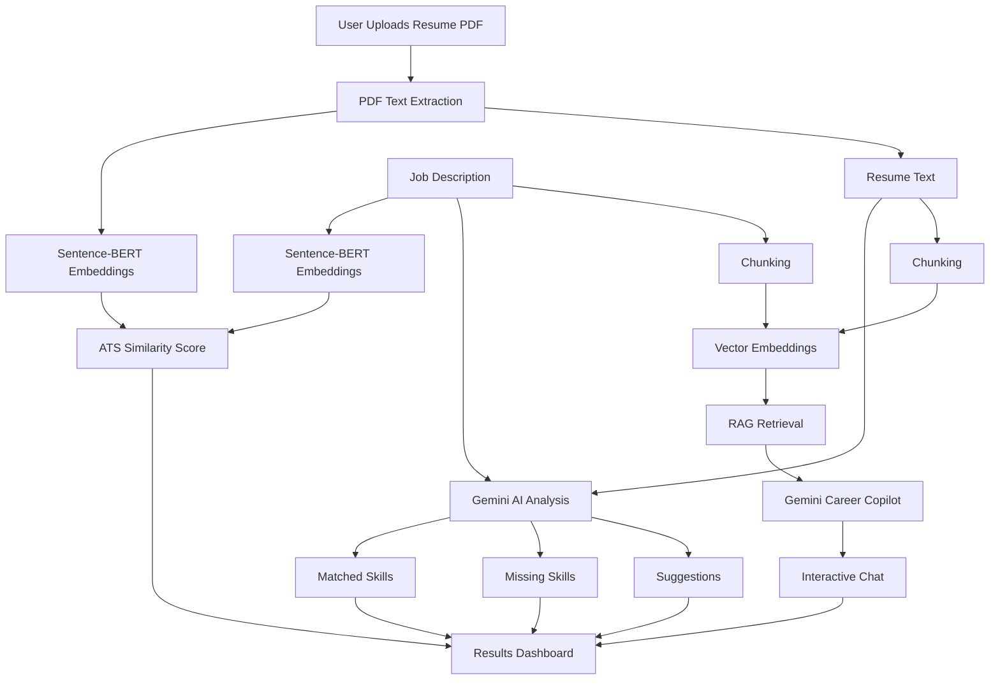
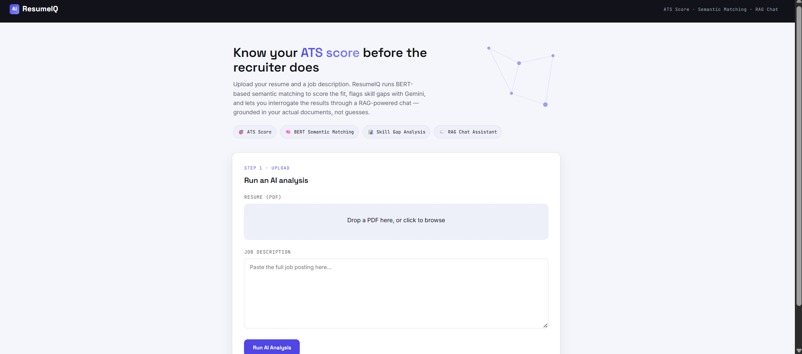
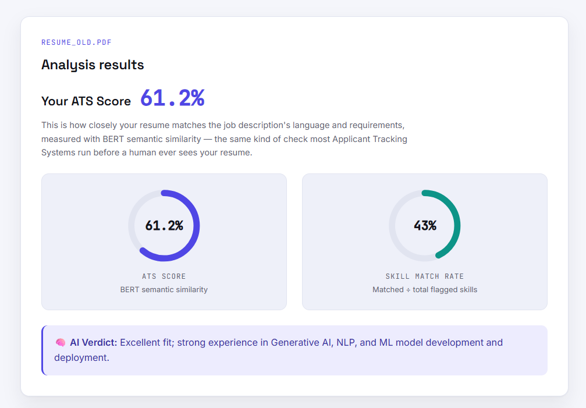
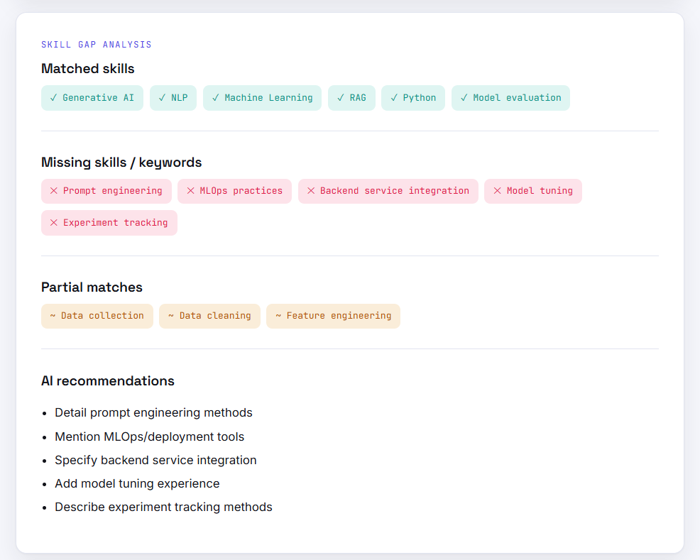
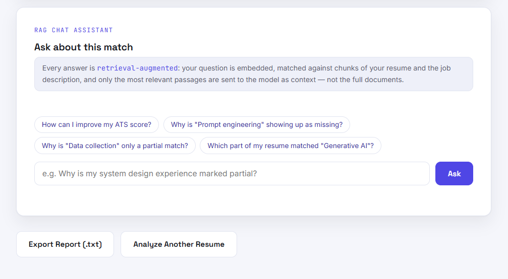

# ATS Score — AI-Powered Resume Analyzer & Career Copilot

[](https://sivaram1024.github.io/ATS_score/)
[](https://github.com/Sivaram1024/ATS_score)
[](https://www.python.org/)
[](https://flask.palletsprojects.com/)
[](https://deepmind.google/technologies/gemini/)
[](https://www.sbert.net/)

> **Live Interactive Demo:** [https://sivaram1024.github.io/ATS_score/](https://sivaram1024.github.io/ATS_score/)

Crafting a strong resume isn't just about matching keywords—it's about demonstrating the right skills and experiences in a way that aligns with the target role. Traditional ATS systems often rely heavily on keyword matching, making it difficult for applicants to understand why their resumes succeed or fail.

**ATS Score (ResumeIQ)** is an AI-powered resume analysis platform that combines **Sentence-BERT semantic similarity**, **Retrieval-Augmented Generation (RAG)**, and **Google's Gemini models (gemini-3.6-flash)** to evaluate how well a resume aligns with a job description.

Instead of only providing an ATS score, the platform explains the reasoning behind the evaluation, identifies skill gaps, highlights matched competencies, and allows users to interact with the analysis through an AI-powered career assistant grounded in the uploaded resume and job description.

---

# 🌐 Live Demo & Deployment

- **GitHub Pages Showcase:** Anyone can instantly explore and test the interface with benchmark candidate profiles, animated ATS score rings, skill gap breakdown, and interactive RAG chat at:  
  👉 **[https://sivaram1024.github.io/ATS_score/](https://sivaram1024.github.io/ATS_score/)**

---

# Why ATS Score?

Most resume analyzers provide only a similarity score or generic AI suggestions. ATS Score goes further by combining semantic understanding with Retrieval-Augmented Generation (RAG) to deliver personalized, context-aware career guidance.

### Traditional Resume Checkers
- Keyword matching only
- Generic suggestions
- No contextual understanding
- Limited interaction after analysis
- Black-box AI feedback

### ATS Score (ResumeIQ)
- Semantic similarity using Sentence-BERT (`sentence-transformers/all-MiniLM-L6-v2`)
- ATS compatibility scoring with cosine similarity
- AI-generated skill gap analysis powered by Google Gemini (`gemini-3.6-flash`)
- Context-aware RAG career assistant grounded in document chunks
- Interactive follow-up questions grounded in uploaded documents
- Exportable `.txt` audit reports

---

# 🚀 Features

## 📄 Intelligent Resume Analysis
- Upload resume PDFs for automated analysis
- Semantic similarity scoring using Sentence-BERT
- ATS compatibility evaluation
- Resume–Job Description matching
- AI-generated career recommendations

## 🧠 AI-Powered Career Insights
- Gemini-powered resume evaluation (`gemini-3.6-flash`)
- Skill gap identification
- Matched skills detection
- Partial skill matching
- Personalized improvement suggestions

## 🔍 Retrieval-Augmented Generation (RAG)
- Resume and Job Description semantic chunking
- Dense vector embeddings
- Context-aware AI responses
- Grounded career guidance based on uploaded documents
- Interactive RAG-powered career assistant

## 💬 Interactive Resume Chat
- Ask follow-up questions about the analysis
- AI explains ATS score and recommendations
- Grounded answers referencing specific resume bullet points
- Suggested starter questions for faster interaction
- Multi-turn conversational experience

## ⚡ User Experience
- Modern responsive Flask interface
- Drag-and-drop resume upload
- Interactive dual radial score visualization
- Skill match dashboard (Matched vs Missing badges)
- Exportable analysis report

---

# 🏗️ System Architecture



---

# 🛠️ Technology Stack

| Category | Technology |
| :--- | :--- |
| **Programming Language** | Python 3.10+ |
| **Backend Framework** | Flask 3.0+ |
| **Frontend** | HTML5, CSS3, Modern JavaScript |
| **AI Model** | Google Gemini (`gemini-3.6-flash`) |
| **Semantic Similarity** | Sentence-BERT (`sentence-transformers/all-MiniLM-L6-v2`) |
| **Vector Retrieval** | Scikit-learn Cosine Similarity & Dense Embeddings |
| **PDF Processing** | PDFMiner (`pdfminer.six`) |
| **Environment Config** | python-dotenv |
| **Hosting & CI/CD** | GitHub Actions & GitHub Pages |

---

# 📂 Folder Structure

```text
ATS_score/
│
├── app.py                      # Flask application factory and server entry point
├── config.py                   # Centralized configuration & environment validation
├── requirements.txt            # Python dependencies
├── README.md                   # Project documentation & guides
├── .gitignore                  # Git ignore rules (protects .env and caches)
├── .env.example                # Template for environment variables
├── LICENSE                     # Open source license
│
├── .github/
│   └── workflows/
│       └── deploy-pages.yml    # Automated GitHub Pages CI/CD workflow
│
├── docs/                       # Live GitHub Pages interactive deployment
│   ├── index.html              # Standalone interactive showcase web app
│   ├── style.css               # Styling and layout
│   ├── demo.js                 # Interactive client demo engine
│   └── screenshots/            # UI screenshots
│
├── routes/
│   └── main_routes.py          # Flask routes (/analyze, /results, /chat, /export)
│
├── services/
│   ├── case_store.py           # In-memory case storage and chat history
│   ├── gemini_service.py       # Gemini API integration & prompt schemas
│   ├── pdf_service.py          # PDF text extraction & validation
│   ├── rag_service.py          # Document chunking, vector indexing & retrieval
│   └── similarity_service.py   # Sentence-BERT embeddings & cosine similarity
│
├── static/
│   ├── css/
│   │   └── style.css           # Modern design system styles
│   └── js/
│       └── chat.js             # Async chat interactions
│
├── templates/
│   ├── base.html               # Base layout with navbar
│   ├── index.html              # Upload page
│   └── results.html            # Results dashboard with scores & Copilot chat
│
└── screenshots/                # Application preview images
```

---

# ⚙️ Local Installation & Setup

### 1. Clone the Repository

```bash
git clone https://github.com/Sivaram1024/ATS_score.git
cd ATS_score
```

### 2. Create and Activate Virtual Environment

**Windows:**
```bash
python -m venv .venv
.venv\Scripts\activate
```

**Linux / macOS:**
```bash
python3 -m venv .venv
source .venv/bin/activate
```

### 3. Install Dependencies

```bash
pip install -r requirements.txt
```

### 4. Configure Environment Variables

Create a `.env` file from the provided example:

```bash
cp .env.example .env   # Linux/Mac
copy .env.example .env # Windows
```

Edit `.env` and fill in your Gemini API Key:

```env
GEMINI_API_KEY=your_actual_gemini_api_key_here
FLASK_SECRET_KEY=replace-with-a-random-secret-key

# Optional model overrides (defaults are optimized for speed and accuracy)
GEMINI_MODEL=gemini-3.6-flash
BERT_MODEL_NAME=sentence-transformers/all-MiniLM-L6-v2
```

### 5. Run the Application

```bash
python app.py
```

Open your browser and navigate to:
```text
http://localhost:5000
```

---

# 📸 Screenshots

### 🏠 Home / Upload Page
Modern drag-and-drop resume upload and target job posting input.


### 📊 Results Dashboard
ATS Score, skill coverage percentage, and AI verdict.


### 🎯 Skill Gap Analysis
Matched competencies, missing skills, and actionable recommendations.


### 💬 Grounded AI Career Copilot
Multi-turn conversational assistant grounded in document passages.


---

# 📄 License

This project is licensed under the MIT License.
