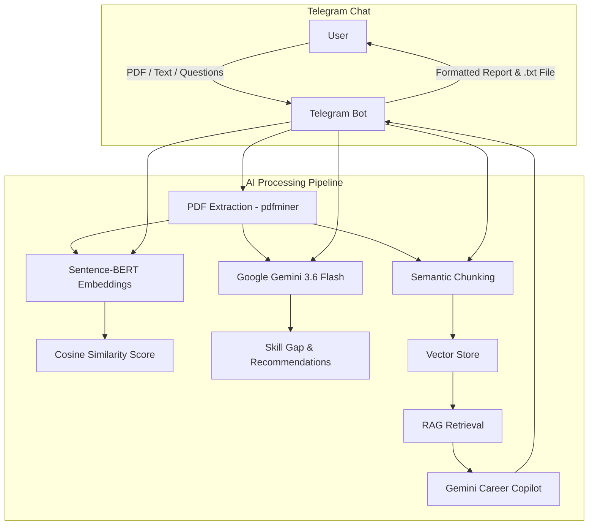

# ATS Score — AI-Powered Resume Analyzer & Telegram Career Copilot

[](https://t.me/MyResumeIQBot)
[](https://www.python.org/)
[](https://deepmind.google/technologies/gemini/)
[](https://www.sbert.net/)

> **Try it now:** [@MyResumeIQBot on Telegram](https://t.me/MyResumeIQBot)

**ATS Score** is a Telegram Chatbot that evaluates how well your resume matches a target job description using **Sentence-BERT semantic similarity**, **Google Gemini AI audit**, and a **Retrieval-Augmented Generation (RAG) Career Copilot**.

Upload your resume PDF, paste a job description, and get instant ATS scoring, skill gap analysis, and interactive AI career coaching — all inside Telegram.

---

## 🤖 How It Works

```
You (Telegram)
  │
  ├── 📎 Send Resume PDF or paste text
  │       └── Bot extracts text via pdfminer
  │
  ├── 📝 Paste Job Description
  │       └── Bot runs Sentence-BERT + Gemini analysis
  │           ├── ATS Match Score (%)
  │           ├── Matched Skills
  │           ├── Missing Skills
  │           └── Recommendations
  │
  ├── 💬 Ask follow-up questions
  │       └── RAG Career Copilot (grounded in your resume)
  │
  └── 📄 /export → Download .txt audit report
```

---

## 🎯 Features

- **Direct PDF Upload** — Send any `.pdf` resume directly into the Telegram chat
- **Semantic ATS Scoring** — Sentence-BERT cosine similarity between resume and job description
- **AI Skill Gap Analysis** — Google Gemini identifies matched skills, missing skills, and provides actionable recommendations
- **RAG Career Copilot** — Ask follow-up questions grounded in your resume and job description chunks
- **Downloadable Reports** — Export a formatted `.txt` audit report with `/export`
- **Instant Demo** — Try `/sample` to test with a pre-loaded benchmark profile

---

## 📋 Bot Commands

| Command | What it does |
| :--- | :--- |
| `/start` | Welcome message and workflow overview |
| `/help` | Guide on sending resumes and chatting |
| `/sample` | Instant demo with a sample resume & job description |
| `/report` | Re-display the latest ATS score and skill analysis |
| `/export` | Download a `.txt` ATS audit report |
| `/reset` | Clear session and start a fresh evaluation |

---

## 🏗️ Architecture



---

## 🛠️ Technology Stack

| Component | Technology |
| :--- | :--- |
| **Bot Framework** | `python-telegram-bot` v22.8 |
| **Language** | Python 3.10+ |
| **AI Model** | Google Gemini (`gemini-3.6-flash`) |
| **Semantic Similarity** | Sentence-BERT (`all-MiniLM-L6-v2`) |
| **Vector Retrieval** | Scikit-learn Cosine Similarity |
| **PDF Extraction** | PDFMiner (`pdfminer.six`) |
| **Config** | python-dotenv |

---

## 📂 Project Structure

```
ATS_score/
├── bot.py                  # Telegram Bot (main entry point)
├── config.py               # Environment configuration
├── requirements.txt        # Python dependencies
├── .env.example            # Template for environment variables
├── .gitignore              # Protects .env and caches
│
└── services/
    ├── __init__.py
    ├── case_store.py       # In-memory session & chat history
    ├── gemini_service.py   # Gemini API integration & prompts
    ├── pdf_service.py      # PDF text extraction
    ├── rag_service.py      # Document chunking & vector retrieval
    └── similarity_service.py  # Sentence-BERT embeddings & cosine similarity
```

---

## ⚙️ Setup & Installation

### 1. Clone the Repository

```bash
git clone https://github.com/Sivaram1024/ATS_score.git
cd ATS_score
```

### 2. Create Virtual Environment

```bash
python -m venv .venv

# Windows
.venv\Scripts\activate

# Linux / macOS
source .venv/bin/activate
```

### 3. Install Dependencies

```bash
pip install -r requirements.txt
```

### 4. Configure Environment Variables

```bash
copy .env.example .env   # Windows
cp .env.example .env     # Linux/Mac
```

Edit `.env` with your actual keys:

```env
GEMINI_API_KEY=your_gemini_api_key
TELEGRAM_BOT_TOKEN=your_telegram_bot_token
```

### 5. Get Your Telegram Bot Token

1. Open Telegram and search for [@BotFather](https://t.me/BotFather)
2. Send `/newbot` and follow the prompts
3. Copy the HTTP API token and paste it into your `.env` file

---

## 🚀 Run the Bot

### Option A: Direct Python Run

```bash
python bot.py
```

### Option B: Docker (Recommended for Servers & Cloud)

Using Docker Compose:

```bash
docker compose up -d --build
```

Or using Docker CLI:

```bash
docker build -t ats-bot .
docker run -d --name ats-bot --env-file .env --restart unless-stopped ats-bot
```

---

## ☁️ 24/7 Free Cloud Deployment

To keep your Telegram bot running 24/7 without keeping your computer on, deploy it to any container/Python host:

### Deploy on Railway / Render / Koyeb

1. Fork or push this repository to your GitHub account.
2. Sign up on [Railway](https://railway.app/), [Render](https://render.com/), or [Koyeb](https://www.koyeb.com/).
3. Create a new **Worker / Web Service** and connect your GitHub repo.
4. Add your Environment Variables in the service settings:
   - `GEMINI_API_KEY`
   - `TELEGRAM_BOT_TOKEN`
5. The platform will automatically build from the `Dockerfile` and start the bot!

---

## 💬 Usage Example

1. **Send your resume** — Upload a PDF or paste resume text
2. **Send job description** — Paste the target job posting
3. **Get instant analysis** — ATS score, matched/missing skills, recommendations
4. **Chat with AI Copilot** — Ask questions like:
   - _"How can I improve my score for this role?"_
   - _"Rewrite my summary to match the job requirements"_
   - _"What interview questions should I prepare for?"_
5. **Export report** — Send `/export` to download a `.txt` analysis file

---

## 📄 License

This project is licensed under the MIT License.
